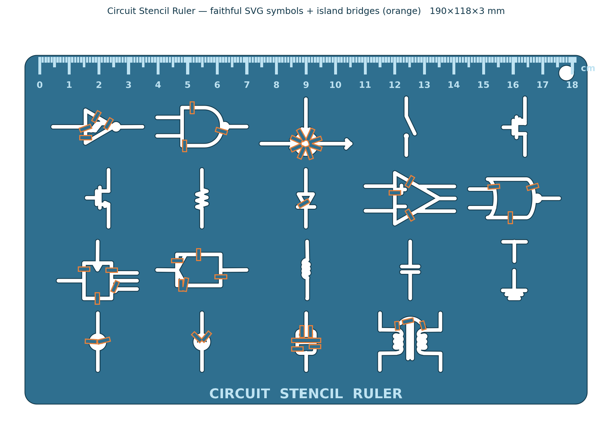

# Circuit Stencil Ruler — 3D Print

A printable circuit-drafting **stencil ruler** built from the **actual symbol
artwork** in [`template_ruler.svg`](template_ruler.svg). The 19 hand-drawn
schematic symbols are parsed straight from the SVG, then only *rearranged and
resized* onto a tidy plate — the shapes themselves are unchanged.

- an engraved **mm / cm measuring scale** along the top edge (0–18 cm)
- **19 faithful through-cut symbols** you trace with a pen — inverter/Schmitt,
  logic gates, latch & flip-flop blocks, MOSFETs, resistor, inductor,
  capacitor, ground, diode, op-amp, voltage/current sources, meter,
  transformer, switch, radiation source
- automatic **stencil bridges** on every enclosed island



*(orange = the bridges; they are solid uncut plate in the real part)*

## Why the bridges matter

In a stencil, any symbol with a closed loop — a triangle interior, a gate body,
a circle, a rectangle, a coil eye, an output bubble — encloses an "island" of
material that would simply **drop out** once cut through. The generator detects
every island automatically (31 of them here) and ties each one back to the body
with tiny **bridges** (34 total, 1.4 mm wide, full plate thickness). The
finished model is a **single connected solid** (verified `body_count == 1`), so
nothing falls out and the ties are mechanically strong enough for repeated use.
Trace over a bridge with your pen and just close the ~1.4 mm gap freehand.

## Files

| File | What it is |
|------|-----------|
| `circuit_ruler.stl` | **The 3D print file.** 190 × 118 × 3 mm, watertight, one solid body. |
| `circuit_ruler_draft.png` | Top-view draft render (bridges highlighted). |
| `circuit_ruler.py` | Generator: arranges the SVG symbols, adds the scale, bridges every island. |
| `svg_source.py` | Faithful `template_ruler.svg` parser + symbol segmenter. |
| `template_ruler.svg` | Original hand-drawn source artwork (unmodified). |

## Print settings

- **Size:** 190 × 118 × 3 mm — fits any bed ≥ 200 × 130 mm.
- **Material:** PLA or PETG.
- **Layer height:** 0.16–0.20 mm.
- **Walls / perimeters:** 3+ (gives the thin plate and the bridges their strength).
- **Infill:** 30–100 %.
- **Supports:** none — flat plate, printed engraved-face up.

Symbol channels are **1.5 mm** wide (trace with a fine pen or 0.5–0.7 mm
pencil); the engraved scale is **0.8 mm** deep.

## Regenerating / customizing

Requires Python 3 with `numpy`, `shapely`, `trimesh`, `manifold3d`,
`mapbox_earcut`, `matplotlib`.

```bash
python3 circuit_ruler.py          # draft PNG only
python3 circuit_ruler.py --stl    # draft PNG + STL
```

Tune the constants at the top of `circuit_ruler.py`: `COLS`/`ROWS` (grid),
`L`/`W`/`T` (plate), `CHANNEL` (slot width), `BRIDGE_W` (tie width),
`ENGRAVE_DEPTH`. Bridge placement is fully automatic — change the layout and it
re-solves which islands need tying.

## License

CC BY 4.0 — free to print, share, and remix with attribution.
